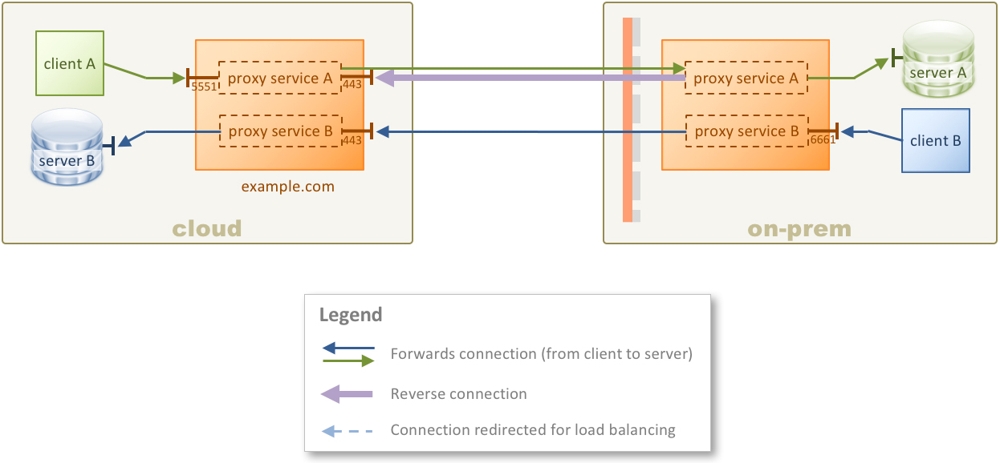
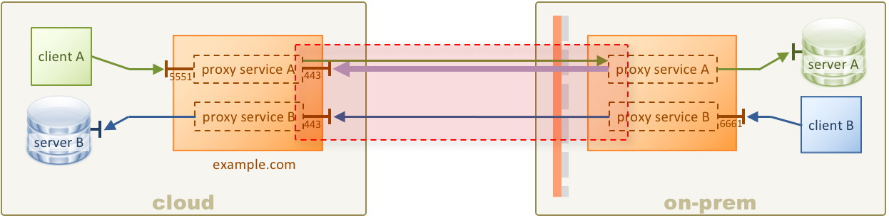
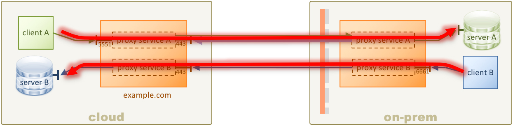

# KWIC TLS with Squid SSL passthrough forward proxy between gateways

(**Note:** Please complete the [1-Simple](../1-simple) tutorial before starting this one.)

Demonstrate a KWIC scenario with TLS/SSL.



In this scenario, connections between the cloud and on-premise instances use TLS, those that are in the red box:



TLS is used to keep data private, but is also used to establish machine-to-machine trust between the two KWIC instances. The cloud instance presents a server certificate to the on-prem instance, and the on-prem instance presents a client certificate to the cloud instance for mutual authentication.

Communication between the cloud instance with **client A** and **server B** is not encrypted. Similarly, communication between the agent with **server A** and **client B** are also not encrypted. However any traffic between the cloud and on-prem instances is encrypted.

If any clients and servers you use support TLS/SSL, then they can encrypt their communication, just as if they were connected directly. This gives you true end-to-end TLS which intermediaries, including KWIC, cannot decrypt, as shown here:



With end-to-end TLS, when **client A**, say, connects, **server A** presents its server certificate. This travels down to **client A** to validates and trusts it. If your client and server support client certificates, then **client A** can present its client certificate to **server A** to validate and trust it.

End-to-end TLS is not shown in this tutorial, as configuring that is the responsibility of the endpoint client and server, which is outside the scope of configuring KWIC. In this scenario, you will learn how to configure TLS between the cloud and on-prem instance.

## Configuration

The configuration for the cloud KWIC instance is in [config/cloud-config.xml](config/cloud-config.xml).

The configuration for the on-prem KWIC instance is in [config/onprem-config.xml](config/onprem-config.xml).

This tutorial uses TLS, so all keys, certificates, and other TLS artifacts are generated automatically when the Docker Compose suite starts.

# Requirements

* You will need Docker and Docker Compose.

* If you don't have **netcat** installed on your system (the `nc` command) then you will need to use a netcat substitute.

See the the **Requirements** section in the [main README](../../README.md) for details of the above.

This tutorial does not need any modification to your hosts file.

# Running the tutorial

In this tutorial you will use **netcat** for the TCP clients **client A**, **client B**. You run netcat by specifying a hostname or IP address, and a port. Once it is connected, you can type something and hit Enter, and you will see your message echoed back from the server.

If you are running on Windows, or don't have netcat installed, everywhere you see `nc 192.168.99.100 5551` in the steps below, replace it with the following command:

```bash
docker run -it --rm konjak/netcat 192.168.99.100 5551
```

## Steps

1. In a terminal window, use Docker Compose to launch all of the Docker containers:

    ```bash
    $ docker-compose up
    ```

    It may take a few moments for all of the containers to start. It's probably ready when you see something like the following lines in the log output on the screen (note that these lines may not be grouped together in the output depending on the order Docker starts containers):

    ```
    example.com_1  | INFO  [tcp#1 172.32.0.4:40484] OPENED: (#00000001: kaazing tcp, server, /172.32.0.4:40484 => /172.32.0.6:443)
    onprem_1       | DEBUG SSL session ID [B@51e5a4aa on transport session #1 (#00000001: kaazing tcp, client, /172.32.0.4:40484 => /172.32.0.6:443): cipher TLS_RSA_WITH_AES_256_CBC_SHA, app buffer size 16916, packet buffer size 16921
    example.com_1  | DEBUG SSL session ID [B@6153daf3 on transport session #1 (#00000001: kaazing tcp, server, /172.32.0.4:40484 => /172.32.0.6:443): cipher TLS_RSA_WITH_AES_256_CBC_SHA, app buffer size 16916, packet buffer size 16921
    example.com_1  | DEBUG SSL session ID [B@304b303f on transport session #1 (#00000001: kaazing tcp, server, /172.32.0.4:40484 => /172.32.0.6:443): cipher TLS_RSA_WITH_AES_256_CBC_SHA, app buffer size 16916, packet buffer size 16921
    onprem_1       | INFO  [ssl#2 172.32.0.4:40484] OPENED: (#00000002: kzg ssl, client, ssl://example.com:443 => ssl://example.com:443)
    example.com_1  | INFO  [wsn#4 172.32.0.4:40484] OPENED: (#00000004: kzg wsn, server, ws://example.com:443/kwic => wss://example.com/kwic)
    onprem_1       | INFO  [wsn#4 172.32.0.4:40484] OPENED: (#00000004: kzg wsn, client, ws://example.com:443/kwic => wss://example.com/kwic)
    ```

    Those lines indicate that the on-prem instance established a TLS-based reverse connection to the cloud instance.

1. In another terminal window, test **client A** connecting to **server A** using netcat. Once it is connected, type `hello` and hit Enter. You will see your message echoed back. Type some more messages if you like, pressing Enter each time. When done, press Ctrl-C to exit netcat. Then do the same for **client B**

    If you don't have netcat installed, then do `docker run -it --rm konjak/netcat 192.168.99.100 5551`.

    If you successfully see the message echoed back, then you know there was roundtrip communication from the netcat client, through the cloud KWIC instance, through the on-prem KWIC instance, to the endpoint **server A**, and back. You can also look at the log output in the Docker Compose terminal window to see the connections being created and stopped.

    ```bash
    # Test client A to server A
    $ nc 192.168.99.100 5551
    hello
    hello
    ^C
    # Test client B to server B
    $ nc 192.168.99.100 6661
    world
    world
    ^C
    ```

# TRACE logging
The docker-compose.yml has both log4j-config.xml and log4j-trace-config.xml available in it. Use the TRACE one to troubleshoot or see details of SOCKS handshake, etc. Be sure to comment out whichever line you are not using. By default log4j-config.xml is commented out for both *example.com* and *onprem* services as shown below:

      #- ./config/log4j-config.xml:/kaazing-gateway/conf/log4j-config.xml:ro
      - ./config/log4j-trace-config.xml:/kaazing-gateway/conf/log4j-config.xml:ro

# Use of Squid configured as "SSL-bump" forward proxy

The Squid proxy is configured as an SSL-bump (AKA MITM) forward proxy. The *onprem* gateway has these Java system properties defined for it:

```
-Dhttp.proxyHost=squid
-Dhttp.proxyPort=3128
```

When the squid container starts, it imports the truststore that was generated for the onprem gateway so that it trusts the cert from the example.com gateway. Further, it also generates a key, and a CA cert, and signed a cert. When the onprem gateway starts, it imports this CA cert into its truststore so it trusts the cert served by Squid.

When the onprem gateway reaches out to example.com (the cloud gateway), Squid will intercept the SSL request, decrypt it, and establish its own SSL connection with the cloud gateway.

Also, the squid.conf has been modified to allow the CONNECT method on port 3128.

## What goes wrong?

Something about the Websocket headers produced by the Squid proxy is wrong. It looks like they are missing a "Connection: Upgrade" header, which is not (yet) supported by Squid:

http://squid-web-proxy-cache.1019090.n4.nabble.com/Squid-Websocket-Issue-td4680870.html

So the cloud gateway fails the inbound Websocket Upgrade request with an "HTTP 400 Bad Request". This eventually gets back to the onprem gateway which logs this as an "HTTP 400 Fatal". The onprem gateway immediately fails the request without falling back to WSE.

onprem log request snippet (note the header "Connection=[Upgrade]"):

```
2017-08-08 21:54:00,673 [New I/O worker #1] INFO  [ssl#3 172.32.0.8:59386] OPENE
D: (#00000003: kzg ssl, client, ssl://example.com:443 => ssl://example.com:443)
2017-08-08 21:54:00,684 [New I/O worker #1] TRACE [ssl#3 172.32.0.8:59386] WRITE
: REQUEST: HTTP/1.1 GET /kwic HEADERS: {User-Agent=[Kaazing Gateway], Upgrade=[w
ebsocket], Sec-WebSocket-Version=[13], Sec-WebSocket-Protocol=[x-kaazing-handsha
ke,null,socks/5+], Sec-WebSocket-Key=[NMcWUAVBpSz+uSCuJ8UGig==], Origin=[https:/
/example.com], Host=[example.com:443], Connection=[Upgrade]} null
2017-08-08 21:54:00,685 [New I/O worker #1] TRACE [proxy#2 172.32.0.8:59386] WRI
TE: HeapBuffer[pos=0 lim=275 cap=1024: 47 45 54 20 2F 6B 77 69 63 20 48 54 54 50
 2F 31...]
2017-08-08 21:54:00,686 [New I/O worker #1] TRACE [tcp#1 172.32.0.8:59386] WRITE
: HeapBuffer[pos=0 lim=325 cap=528: 17 03 03 01 40 CF 9F ED 2D D1 6F 7F 90 8D 45
 52...]
```

example.com log request and response snippet (note that the "Connection:" header now has value "keep-alive"):

```
2017-08-08 21:54:00,690 [New I/O worker #2] DEBUG Processing a MESSAGE_RECEIVED
for session 3
2017-08-08 21:54:00,713 [New I/O worker #2] TRACE HttpMergeRequestFilter: Enteri
ng Request is '/kwic
X-Forwarded-For: [172.32.0.8]
Via: [1.1 2c37260b4f9f (squid/3.5.12)]
User-Agent: [Kaazing Gateway]
Surrogate-Capability: [2c37260b4f9f="Surrogate/1.0 ESI/1.0"]
Sec-WebSocket-Version: [13]
Sec-WebSocket-Protocol: [x-kaazing-handshake, null, socks/5+]
Sec-WebSocket-Key: [NMcWUAVBpSz+uSCuJ8UGig==]
Origin: [https://example.com]
Host: [example.com]
Connection: [keep-alive]
Cache-Control: [max-age=259200]
'.
2017-08-08 21:54:00,715 [New I/O worker #2] TRACE x-kaazing-handshake detected.
2017-08-08 21:54:00,717 [New I/O worker #2] TRACE HttpSubjectSecurityFilter skip
ped because no realm is configured.
2017-08-08 21:54:00,718 [New I/O worker #2] TRACE [ssl#3 172.32.0.5:37010] RECEI
VED: REQUEST: HTTP/1.1 GET /kwic HEADERS: {X-Next-Protocol=[ws/rfc6455], X-Forwa
rded-For=[172.32.0.8], Via=[1.1 2c37260b4f9f (squid/3.5.12)], User-Agent=[Kaazin
g Gateway], Surrogate-Capability=[2c37260b4f9f="Surrogate/1.0 ESI/1.0"], Sec-Web
Socket-Version=[13], Sec-WebSocket-Protocol=[x-kaazing-handshake, null, socks/5+
], Sec-WebSocket-Key=[NMcWUAVBpSz+uSCuJ8UGig==], Origin=[https://example.com], H
ost=[example.com], Connection=[keep-alive], Cache-Control=[max-age=259200]} null

2017-08-08 21:54:00,718 [New I/O worker #2] INFO  [ssl://example.com:443 (ssl://
example.com:443) http/1.1]
  [tcp://172.32.0.5:37010 (tcp://172.32.0.5:37010) ssl] - [example.com] "GET /kw
ic HTTP/1.1 " "Kaazing Gateway"
2017-08-08 21:54:00,726 [New I/O worker #2] INFO  [http#4 172.32.0.5:37010] OPEN
ED: (#00000004: kzg http, server, https://example.com/kwic => https://example.co
m:443/kwic)
2017-08-08 21:54:00,731 [New I/O worker #2] TRACE Setting idle timeout 55 on HTT
P parent session (#00000003: kzg ssl, server, ssl://example.com:443 => ssl://exa
mple.com:443)
2017-08-08 21:54:00,743 [New I/O worker #2] TRACE [ssl#3 172.32.0.5:37010] WRITE
: RESPONSE: 400 WebSocket Upgrade Failure HTTP/1.1 HEADERS: {Content-Type=[text/
html], Date=[Tue, 08 Aug 2017 21:54:00 GMT], Server=[Kaazing Gateway]} CONTENT:
HeapBuffer[pos=0 lim=77 cap=256: 3C 68 74 6D 6C 3E 3C 68 65 61 64 3E 3C 2F 68 65
...]

```

Onprem log snippet with response and shutdown of session without falling back to WSE:

```
2017-08-08 21:54:00,687 [New I/O worker #1] INFO  [http#4 172.32.0.8:59386] OPEN
ED: (#00000004: kzg http, client, http://example.com:443/kwic => https://example
.com:443/kwic)
2017-08-08 21:54:00,750 [New I/O worker #1] TRACE [tcp#1 172.32.0.8:59386] RECEI
VED: HeapBuffer[pos=0 lim=458 cap=458: 17 03 03 01 40 30 03 B5 9B 60 31 8E F8 1D
 F6 AA...]
2017-08-08 21:54:00,751 [New I/O worker #1] TRACE [proxy#2 172.32.0.8:59386] REC
EIVED: HeapBuffer[pos=0 lim=352 cap=458: 48 54 54 50 2F 31 2E 31 20 34 30 30 20
42 61 64...]
2017-08-08 21:54:00,751 [New I/O worker #1] DEBUG Processing a MESSAGE_RECEIVED
for session 3
2017-08-08 21:54:00,753 [New I/O worker #1] DEBUG "400 Bad Request HTTP/1.1"
2017-08-08 21:54:00,756 [New I/O worker #1] TRACE [ssl#3 172.32.0.8:59386] RECEIVED: RESPONSE: 400 Bad Request HTTP/1.1 HEADERS: {Connection=[keep-alive], Content-Length=[77], Content-Type=[text/html], Date=[Tue, 08 Aug 2017 21:54:00 GMT], Server=[Kaazing Gateway], Via=[1.1 2c37260b4f9f (squid/3.5.12)], X-Cache=[MISS from 2c37260b4f9f], X-Cache-Lookup=[MISS from 2c37260b4f9f:3128]} CONTENT: HeapBuffer[pos=0 lim=77 cap=77: 3C 68 74 6D 6C 3E 3C 68 65 61 64 3E 3C 2F 68 65...]
2017-08-08 21:54:00,757 [New I/O worker #1] TRACE [http#4 172.32.0.8:59386] RECEIVED: HeapBuffer[pos=0 lim=77 cap=77: 3C 68 74 6D 6C 3E 3C 68 65 61 64 3E 3C 2F 68 65...]
2017-08-08 21:54:00,758 [New I/O worker #1] DEBUG WsnConnector: failing connection with exception java.net.ConnectException: Unexpected HTTP response 400 - Bad Request

```
## What should happen?

The onprem gateway should fall back to WSE which should work.

